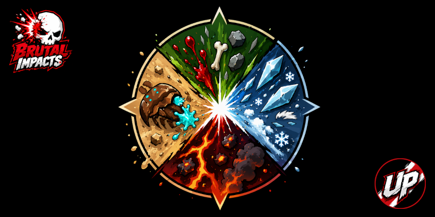
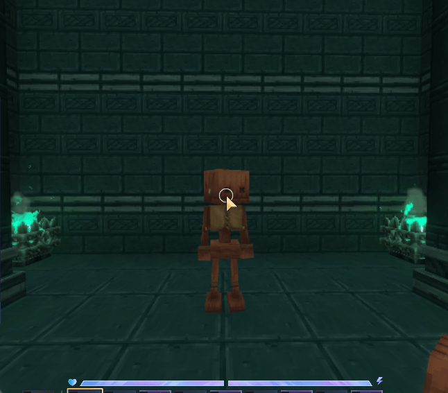
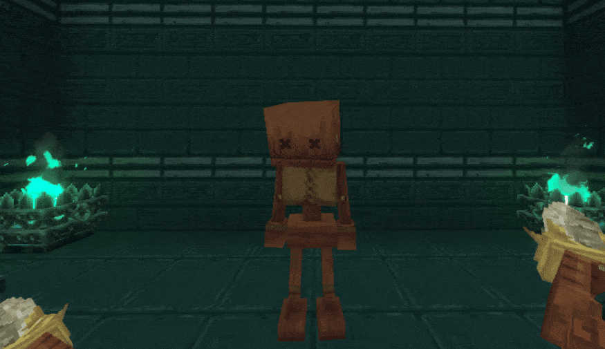

✨ Brand New User Interface (UI)

Your experience just leveled up. The mod now features an intuitive User Interface, making configuration faster, clearer, and more enjoyable than ever.

/brutalimpactsui

---

🖱️ New Preset Styles

Inside the new UI, you’ll find three one-click presets to instantly match your preferred particle style:

* Clean – A vanilla-like style.
* Normal – Balanced visuals for everyday gameplay.
* Brutal – Maximum intensity for a dramatic and violent experience.

Switch between them anytime and find the vibe that fits your playstyle.

---

⚙️ Advanced Customization Options

Take full control over how your particles behave with new adjustable parameters:

* Minimum Scale: Sets the lower bound for particle size.
* Maximum Scale: Defines the upper bound for particle size.
* Global Scale Multiplier: This acts as a sensitivity factor, scaling particle size dynamically based on the intensity of the hit.
* Particle Multiplier: Determines how many particle spawners are triggered per damage event.

Fine-tune your visuals, push the limits, and make every hit feel exactly the way you want.

---

🔥 Now it reacts to damage!!🔥

As you can see, the more damage is caused, the greater the number and scale of the particle effects will be.

# Brutal Impacts

Brutal Impacts is a Hytale server mod that adds **extra impact particles** when entities take damage.
It does **not** replace vanilla particles; it appends additional world particles to the damage event.

Currently, all mobs have extra particles; they aren't the best, but I'll try to improve them in future updates.

This mod supports both the base game's particle systems and custom ones created by users.

## Configuration (Hit Particles JSON)

On startup, the mod creates/uses a data directory named `BrutalImpacts/` **next to the mod JAR** and loads hit particle rules from `*.json` files inside it.

You can override the base directory with the JVM system property:

`-Dbrutalimpacts.dir=<path>` → data dir becomes `<path>/BrutalImpacts/`

### Files

- `DefaultHitParticles_ReadOnly.json`
  - Bundled defaults (read-only example).
  - Overwritten when the mod updates.
- `USER_HitParticles.json`
  - Your personal overrides.
  - Created once and never overwritten on updates.
- `Weapons_ReadOnly.json`
  - Bundled defaults for source/weapon multipliers (read-only example).
  - Overwritten when the mod updates.
- `USER_Weapons.json`
  - Your personal weapon/source overrides.
  - Created once and never overwritten on updates.
- Any other `*.json` file (e.g. `MoreAnimals.json`)
  - Additional hit-particle rules, weapon/source tuning, or both (useful for modpacks / servers).

### Priority (override order)

When multiple JSON files define rules for the same model id, priority is:

1. `USER_HitParticles.json` (highest)
2. Other `*.json` (sorted by filename)
3. `DefaultHitParticles_ReadOnly.json` (lowest)

Tip: if you need one modder file to win over another, prefix the filename (e.g. `00_MoreAnimals.json`).

Weapon/source tuning follows the same priority, using the `sources` and `weapons` sections.

### Hot reload

After editing any JSON file, reload rules in-game:

- `/brutalimpacts --reload`

### Debug mode

You can toggle verbose debug output in-game with:

- `/brutalimpacts --debug`

### Default Particles

The default particles (the blood splatter) can be replaced using:

- `/brutalimpacts --particle <ParticleSystemId>`

## JSON format

The bundled README shipped into the data directory includes the full JSON schema + examples:

- `BrutalImpacts/README.md` (generated at runtime)
- `src/main/resources/brutalimpacts/README.md` (source copy in this repo)

## Developer API (optional)

Other mods/plugins can register rules at runtime via:

- `dev.hytalemodding.api.BrutalImpactsApi.hitParticles()`

## Resources

- Hytale Modding Guides: https://hytalemodding.dev
- Hytale Modding Discord: https://discord.gg/hytalemodding
- ScaffoldIt Plugin Docs: https://scaffoldit.dev
